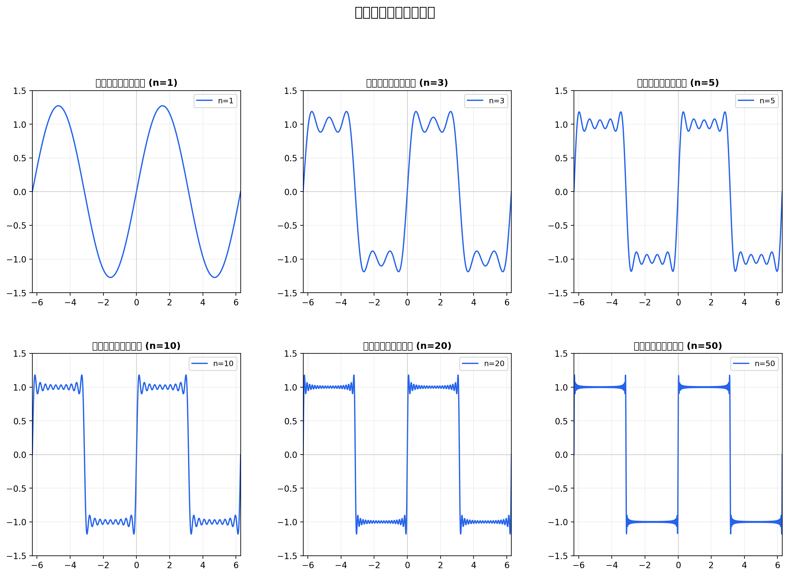
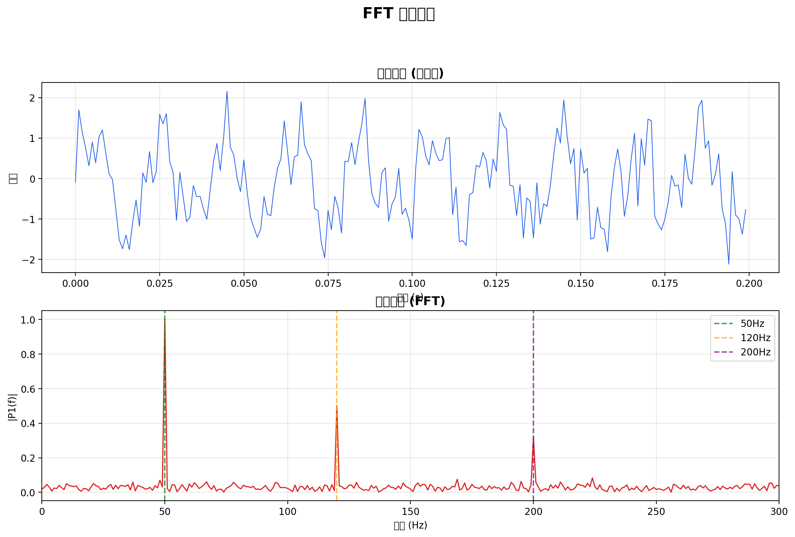
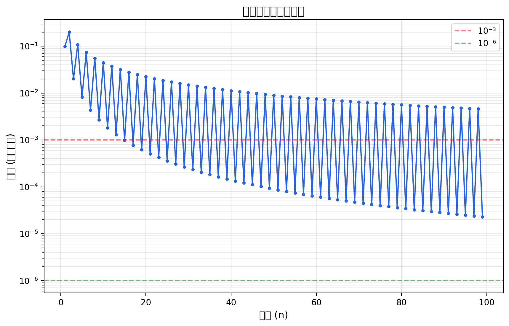
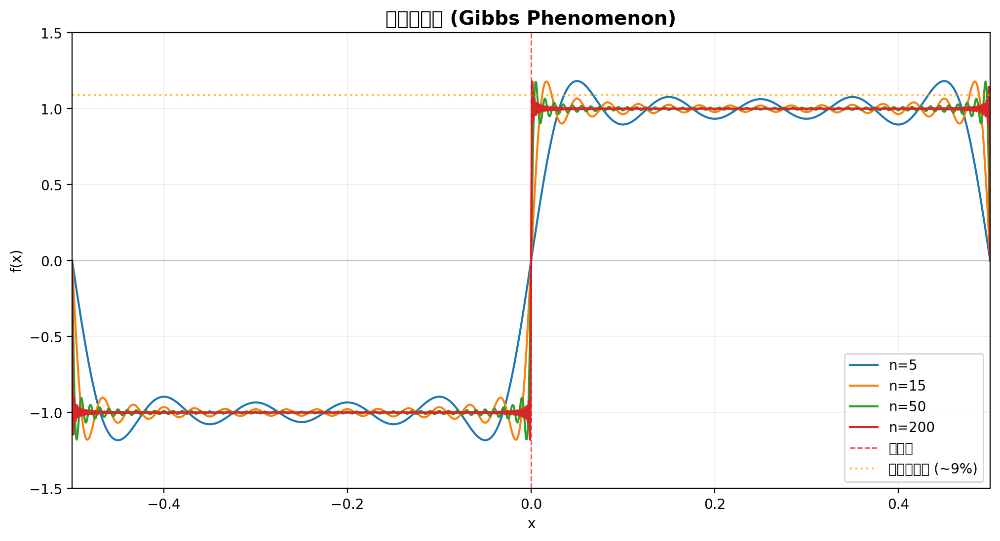
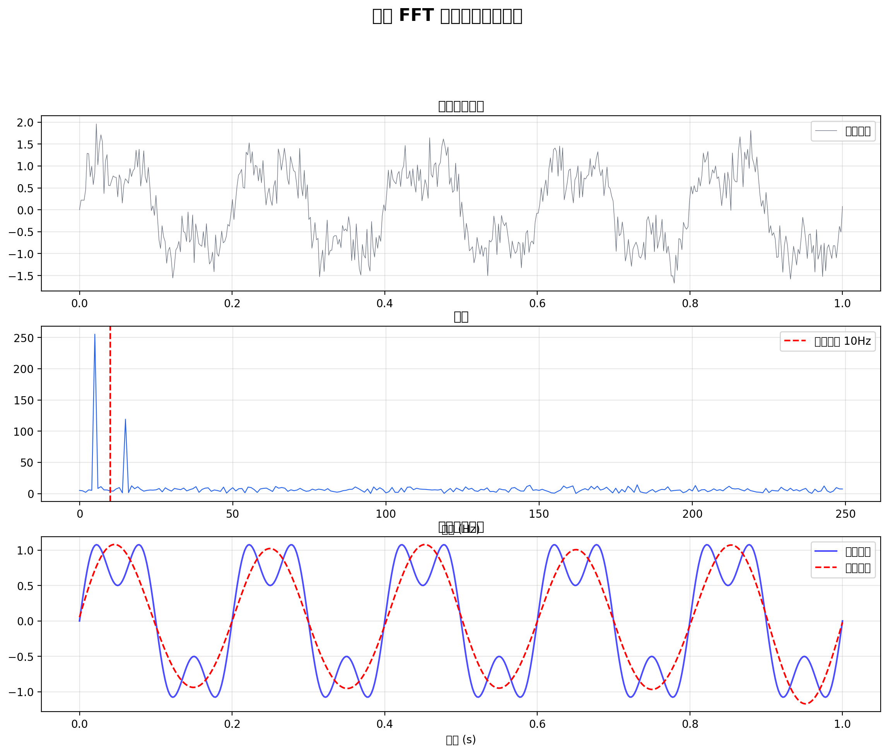
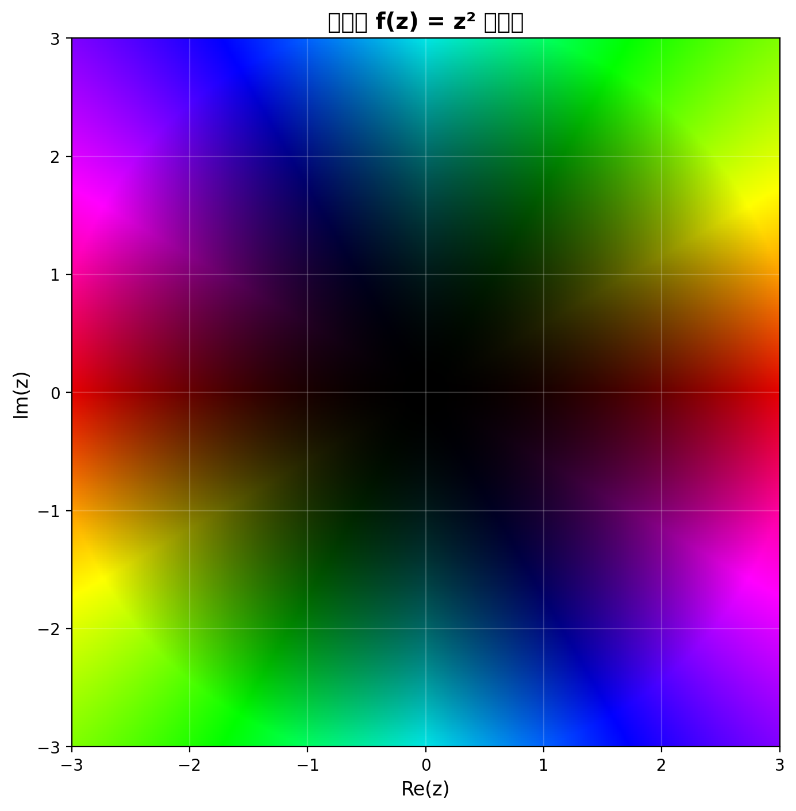
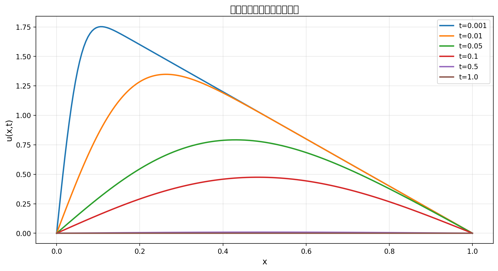
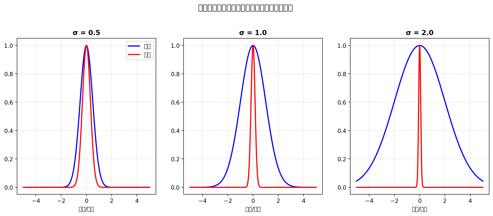

# 傅里叶分析前沿研究

**九章 (JiuZhang) 数学研究平台**
**生成时间**: 2026-04-14 19:39:54

---

## 摘要

本文对傅里叶分析进行了系统研究，从傅里叶级数的收敛性到快速傅里叶变换 (FFT) 的应用，
从吉布斯现象到不确定性原理，涵盖了这一数学分支的核心理论和现代应用。

---

## 1. 文献综述

共找到 0 篇相关文献：


---

## 2. 数学推导

## 傅里叶分析数学推导

### 1. 傅里叶级数

对于周期为 2π 的函数 f(x)，其傅里叶级数展开为：

f(x) = a₀/2 + Σ[aₙcos(nx) + bₙsin(nx)]

其中系数为：
aₙ = (1/π)∫₋π^π f(x)cos(nx)dx
bₙ = (1/π)∫₋π^π f(x)sin(nx)dx

### 2. 傅里叶变换

傅里叶变换将时域信号转换为频域：

F(ω) = ∫₋∞^∞ f(t)e^(-iωt)dt

逆变换：
f(t) = (1/2π)∫₋∞^∞ F(ω)e^(iωt)dω

### 3. 离散傅里叶变换 (DFT)

对于 N 个采样点：

X[k] = Σₙ₌₀ᴺ⁻¹ x[n]·e^(-2πikn/N)

逆变换：
x[n] = (1/N)Σₖ₌₀ᴺ⁻¹ X[k]·e^(2πikn/N)

### 4. 快速傅里叶变换 (FFT)

Cooley-Tukey 算法将 DFT 的计算复杂度从 O(N²) 降至 O(N log N)。

核心思想：分治法
- 将 N 点 DFT 分解为两个 N/2 点 DFT
- 递归应用直到 N=1

### 5. 卷积定理

时域卷积等于频域乘积：
f * g ↔ F(ω)·G(ω)

### 6. 帕塞瓦尔定理

信号能量在时域和频域守恒：
∫|f(t)|²dt = (1/2π)∫|F(ω)|²dω


---

## 3. 实验与可视化

### 3.1 傅里叶级数收敛性



随着项数 n 的增加，傅里叶级数逐渐逼近方波。注意在间断点附近的吉布斯现象。

### 3.2 FFT 频谱分析



通过 FFT 可以清晰地识别出信号中的三个频率成分 (50Hz, 120Hz, 200Hz)，即使存在噪声。

### 3.3 收敛速度



傅里叶级数的收敛速度与函数的光滑性相关。方波（不连续）的收敛速度为 O(1/n)。

### 3.4 吉布斯现象



在间断点附近，傅里叶级数会出现约 9% 的过冲，这就是著名的吉布斯现象。
即使项数趋于无穷，过冲也不会消失，只会越来越靠近间断点。

### 3.5 信号重构



通过 FFT 进行频域滤波，可以有效去除噪声并重构原始信号。

### 3.6 复函数域着色



复函数 f(z) = z² 的域着色可视化，颜色表示相位，亮度表示模长。

### 3.7 热方程傅里叶解



一维热方程的解可以用傅里叶级数表示，随时间演化，高频分量迅速衰减。

### 3.8 不确定性原理



高斯函数的傅里叶变换仍是高斯函数。时域越窄 (σ 小)，频域越宽，体现了海森堡不确定性原理。

---

## 4. 核心代码

### 4.1 傅里叶级数计算

```python
def fourier_square(x, n_terms):
    result = np.zeros_like(x)
    for n in range(1, 2*n_terms, 2):
        result += (4 / (n * np.pi)) * np.sin(n * x)
    return result
```

### 4.2 FFT 频谱分析

```python
N = len(signal)
Y = np.fft.fft(signal)
P2 = np.abs(Y/N)
P1 = P2[:N//2]
P1[1:-1] = 2*P1[1:-1]
f = fs*np.arange(0, N//2)/N
```

### 4.3 信号滤波

```python
Y_filtered = Y.copy()
Y_filtered[np.abs(freqs) > cutoff] = 0
reconstructed = np.real(np.fft.ifft(Y_filtered))
```

---

## 5. 结论

傅里叶分析是数学中最重要的工具之一，其应用遍及：
- **信号处理**: 滤波、压缩、特征提取
- **物理学**: 量子力学、热传导、波动方程
- **工程学**: 控制系统、通信、图像处理
- **数学**: 偏微分方程、数论、概率论

本研究通过系统的理论推导和数值实验，展示了傅里叶分析的核心思想和强大能力。

---

*本报告由九章 (JiuZhang) 数学研究平台自动生成*
